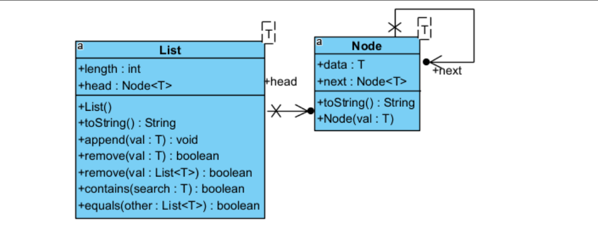
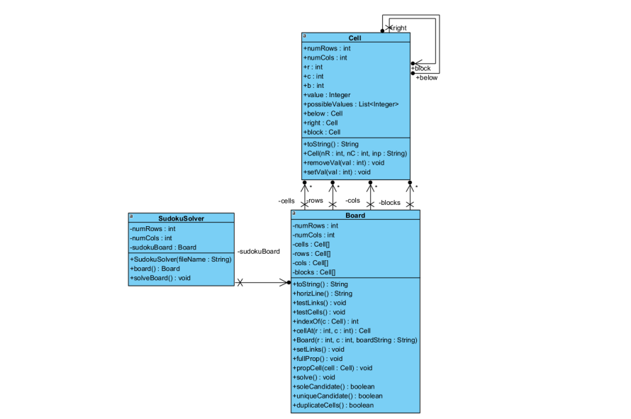

# Sudoku Puzzle in Java

---

## Introduction

Sudoku is a classic puzzle game originating from the 18th century. It traditionally involves a 9x9 grid divided into 3x3 subgrids, where each cell can hold a number between 1 and 9. The objective is to fill all cells with numbers such that no row, column, or subgrid contains duplicate numbers.

In this generalized version, the Sudoku grid has dimensions `numRows × numCols`, meaning each cell can hold a number between 1 and `numRows * numCols`. The standard Sudoku rules (no duplicates in rows, columns, and subgrids) still apply.

---

## Key Features

1. Dynamic Grid Size: Support for grids of varying sizes such as 2x3, 3x4, etc.
2. **Iterative Methods for Solving**:
   - Sole Candidate
   - Unique Candidate
   - Duplicate Cells
3. **Data Structures**:
   - Linked Lists
   - 3D Sparse Table

---

## Board Linking Overview

The Sudoku board is constructed using a 3D grid. Each cell within the grid contains possible values, and iterative methods are employed to solve the puzzle by eliminating impossible candidates. Below is a visual representation of the board linking:

*Note: Refer to the linked image for details.*

---

## Class Diagrams

### Linked List and Node Classes

The linked list forms the backbone of the data structure for storing cells and their possible values. Each cell is represented as a node, and the linked list enables easy traversal and manipulation of the board's state.



---

### Cell, Board, and SudokuSolver Classes

These classes work together to represent the puzzle grid and solve it. Each cell holds potential values, and the `SudokuSolver` class implements methods to iteratively solve the puzzle.



---

## Requirements Before Running Code

1. **Java Development Kit (JDK) Installation**  
   You need to install JDK to compile and run Java code. JDK 17 is recommended. Here are some tutorials to help with setup:
   
   - **Install Java JDK 17 on Windows 11:**  
     Follow this YouTube tutorial to install JDK 17:  
     [How to Install Java JDK 17 on Windows 11](https://www.youtube.com/watch?v=ykAhL1IoQUM&t=136s)

   - **Setup WSL (Windows Subsystem for Linux) and Run It from Visual Studio Code:**  
     If you're using WSL, you can run the Ubuntu terminal shell directly from Visual Studio Code. Learn how to set it up using this guide:  
     [Setup WSL and Run from VS Code](https://www.youtube.com/watch?v=fp45HpZuhS8&t=112s)

2. **Installing Oracle JDK on Windows Subsystem for Linux (WSL)**  
   If you're working in a WSL environment, follow these steps to install Oracle JDK:

   - Run the WSL terminal as **Administrator**.
   - Set necessary permissions and variables:
   
     ```bash
     set -ex
     export JDK_URL=http://download.oracle.com/otn-pub/java/jdk/8u131-b11/d54c1d3a095b4ff2b6607d096fa80163/jdk-8u131-linux-x64.tar.gz
     export UNLIMITED_STRENGTH_URL=http://download.oracle.com/otn-pub/java/jce/8/jce_policy-8.zip
     ```

   - Download the JDK and unzip the archive:

     ```bash
     wget --no-cookies --header "Cookie: oraclelicense=accept-securebackup-cookie" ${JDK_URL}
     tar -xzvf jdk-*.tar.gz
     rm -fr jdk-*.tar.gz
     ```

   - Move the JDK to the correct directory and configure it:

     ```bash
     sudo mkdir -p /usr/lib/jvm
     sudo mv jdk1.8* /usr/lib/jvm/oracle_jdk8
     wget --no-cookies --header "Cookie: oraclelicense=accept-securebackup-cookie" ${UNLIMITED_STRENGTH_URL}
     unzip jce_policy-8.zip
     mv UnlimitedJCEPolicyJDK8/local_policy.jar /usr/lib/jvm/oracle_jdk8/jre/lib/security/
     mv UnlimitedJCEPolicyJDK8/US_export_policy.jar /usr/lib/jvm/oracle_jdk8/jre/lib/security/
     ```

   - Configure alternatives for Java and Javac:

     ```bash
     sudo update-alternatives --install /usr/bin/java java /usr/lib/jvm/oracle_jdk8/jre/bin/java 2000
     sudo update-alternatives --install /usr/bin/javac javac /usr/lib/jvm/oracle_jdk8/bin/javac 2000
     ```

   - Set environment variables:

     ```bash
     sudo echo "export J2SDKDIR=/usr/lib/jvm/oracle_jdk8
     export J2REDIR=/usr/lib/jvm/oracle_jdk8/jre
     export PATH=$PATH:/usr/lib/jvm/oracle_jdk8/bin:/usr/lib/jvm/oracle_jdk8/db/bin:/usr/lib/jvm/oracle_jdk8/jre/bin
     export JAVA_HOME=/usr/lib/jvm/oracle_jdk8
     export DERBY_HOME=/usr/lib/jvm/oracle_jdk8/db" | sudo tee -a /etc/profile.d/oraclejdk.sh
     ```

   > **Note**: You can update the links for other JDK versions if needed.

---

## Compilation and Execution

### Using the Makefile

A Makefile is provided to streamline the process of compiling and running the Sudoku puzzle in the terminal.

#### Makefile Commands:

- `make`: Compiles the `.java` files.
- `make run`: Executes the `Main` class to run the program.
- `make clean`: Removes all compiled class files and resets the terminal.
- `make tar`: Compresses the Java files and the Makefile into a `.tar.gz` archive.
- `make unzip`: Extracts files from a `.tar` archive.

```Makefile
default:
	javac *.java

run:
	java Main

clean:
	rm -f *.class
	reset
	clear

tar:
	tar -cvz *.java makefile -f Sudoku.tar.gz

unzip:
	tar -zxvf *.tar
```

---

## Conclusion

This implementation of Sudoku in Java extends the traditional rules of the game to allow for dynamic grid sizes and iterative solving techniques. Using Linked Lists and a 3D Sparse Table as core data structures, the Sudoku puzzle is solved using methods like Sole Candidate and Unique Candidate, ensuring a logical and efficient solution to the puzzle.

## Contributing

This project is mainly for educational purposes. However, if you have suggestions or improvements, feel free to open an issue or submit a pull request.

---

## License

This project is open source. Please check the repository for more specific license details.
